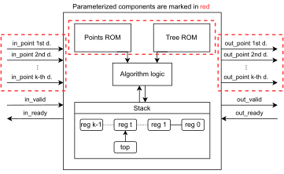
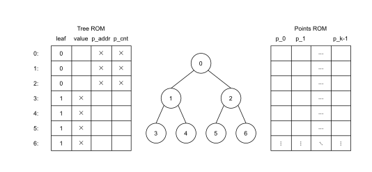

# Nearest Neighbour Search Design Generator

This is a digital hardware module generator written in [Chisel](https://www.chisel-lang.org/), a hardware design language embedded in [Scala](https://www.scala-lang.org/). The generated instances execute the [Nearest Neighbour Search (NNS)](https://en.wikipedia.org/wiki/Nearest_neighbor_search) algorithm, returning the closest point to an input point from a predefined set of points. The algorithm uses a [*k*-dimensional tree](https://en.wikipedia.org/wiki/K-d_tree) as a means to efficiently calculate the result of a query point. Both the points and *k*-d tree structure are pre-stored in memory. The following diagram represents the general structure of an instance:



Each of the coordinates of the input and output *k*-dimensinal points are signed integers. Extra I/O signals represent the Ready/Valid interface.

## Interface

[Decoupled](https://www.chisel-lang.org/chisel3/docs/explanations/interfaces-and-connections.html#the-standard-ready-valid-interface-readyvalidio--decoupled) interface is used where `.bits` are data representing the input or output point. The following signals are defined:

* `in: Vec[SInt] = Flipped(Decoupled(t: Vec[SInt]))`
* `out: Vec[SInt] = Decoupled(t: Vec[SInt])`

## Memory Layout

The memory is consisted of two ROMs implemented as single-port block RAMs; one contains the pre-defined *k*-dimensional points, and the other contains the *k*-d tree structure. The memory structure is depicted below:



Entries in the Points ROM each consist of *k* signed integers, each representing a coordinate of a single point. Parameterized properties of Points ROM include: *k*, bit-width of each point cooridnate, and total number of points. Points are contained only in leaf nodes of the *k*-d tree; one leaf node may contain one or more points. All points belonging to the same leaf node need to have consecutive memory locations in Points ROM.

Entries in the Tree ROM represent individual nodes of a *k*-d tree. The order of nodes in Tree ROM represents the [heap ordering](http://www.math.clemson.edu/~warner/M865/HeapSpecs.html) of the *k*-d tree. In the image above, indices on the left of each row in Tree ROM correspond to indices inside *k*-d tree nodes. Each Tree ROM entry consists of four values:

* *leaf* (single bit): Represents whether the node is a leaf node.
* *value* (parameterized bit-width): Discriminator value used for decision-making during the execution of the NNS algorithm; this should be the appropriate coordinate's median value of all points contained in the subspace represented by this node. This value is applicable only to non-leaf nodes.
* *p_addr* (parameterized bit-width): Location in Points ROM of the first point contained in this node. This value is applicable only to leaf nodes.
* *p_cnt* (parameterized bit-width): Number of points contained in the node. This value is applicable only to leaf nodes.

Parameterized properties of Tree ROM include the number of nodes, and all values of each node except for *leaf* which is always one bit wide.

## Generator Parameters

Deisgn parameters are defined inside the class `KdTreeModule`:
```scala
class KdTreeModule(
  pointElemWidth: Int,
  pRomAddressWidth: Int,
  treeDepth: Int,
  pointNumDimensions: Int,
  romInit: (
    Seq[(Boolean, Int, Int, Int)],
    Seq[Seq[Int]]
  ),
  pRomFilename: String = "p_rom.mem",
  treeRomFilename: String = "tree_rom.mem"
)
```

The parameters have the following meanings:

* `pointElemWidth`: Bit-width of each coordinate of a point.
* `pRomAddressWidth`: Bit-width of addresses in Points ROM. Thus, the depth of Tree ROM is equal to `2^pRomAddressWidth`.
* `treeDepth`: Depth of *k*-d tree. As the tree is a [complete binary tree](http://www.math.clemson.edu/~warner/M865/HeapSpecs.html), the depth of Tree ROM is equal to `2^treeDepth - 1`.
* `pointNumDimensions`: Number of dimensions *k* of each point.
* `romInit`: Contents of Tree ROM and Points ROM, respectively; represented as a tuple of two. The first element of the tuple is a sequence of nodes in Tree ROM; the second element of the tuple is a sequence of points in Points ROM. The structure of these sequences follow the structure of the memory layout depicted above.
* `pRomFilename`: Name of file in the `out` directory where Points ROM data will be written.
* `treeRomFilename`: Name of file in the `out` directory where Tree ROM data will be written.

Files specified by parameters `pRomFilename` and `treeRomFilename` are written to during instance construction, and are used for memory initialization during synthesis and implementation.

## Deriving *k*-d Tree Structure From a List of Points

In order for an instance to work correctly, the pre-stored *k*-d tree structure needs to be correct. It's impractical to manually derive the tree structure for a set of points, so utilities are provided to that end in the form of the class `KdTree`. The actual purpose of this class is to be a *k*-d tree software golden model used for testing hardware instances, but it also provides a way to construct a *k*-d tree from a list of points, which can then be passed to `KdTreeModule` as an alternative to specifying the `romInit` parameter. The following is a way to construct a `KdTreeModule` instance using a list of points rather than explicitly specifying *k*-d tree structure:

```scala
val points = Seq(Vector(7, 4), Vector(1, -3), Vector(-2, 4), Vector(4, 3), Vector(0, 7), Vector(-8, 6), Vector(2, -5))
val numNodes = 3
val tree = KdTree[Vector[Int], Int](numNodes, points)
val pointElemWidth = 4
val pRomAddressWidth = 3
def module = KdTreeModule.fromKdTree(tree, pointElemWidth, pRomAddressWidth)
```
